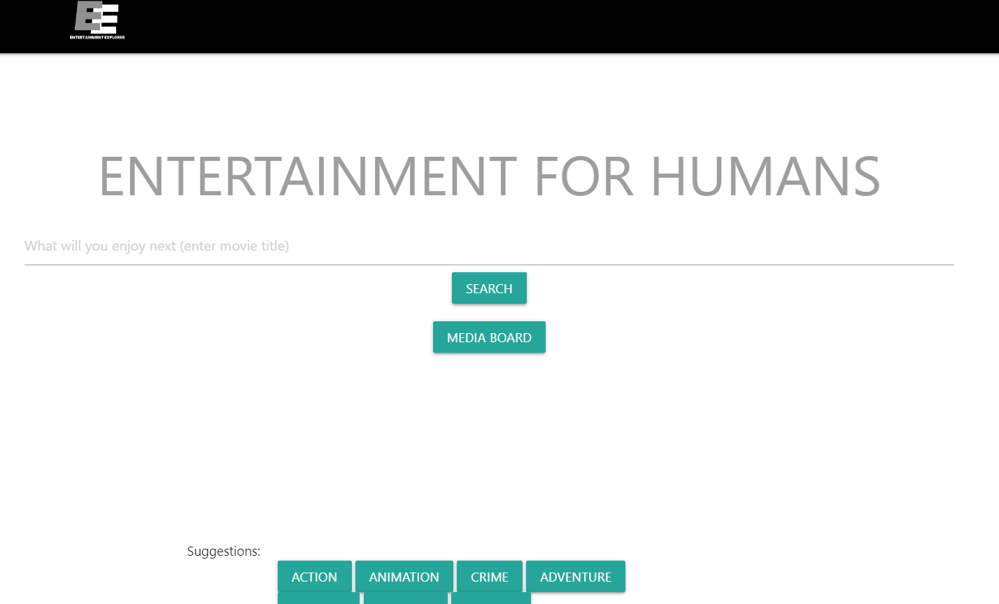
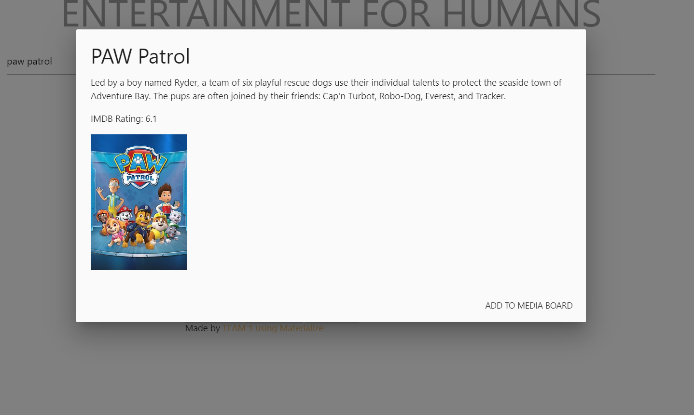
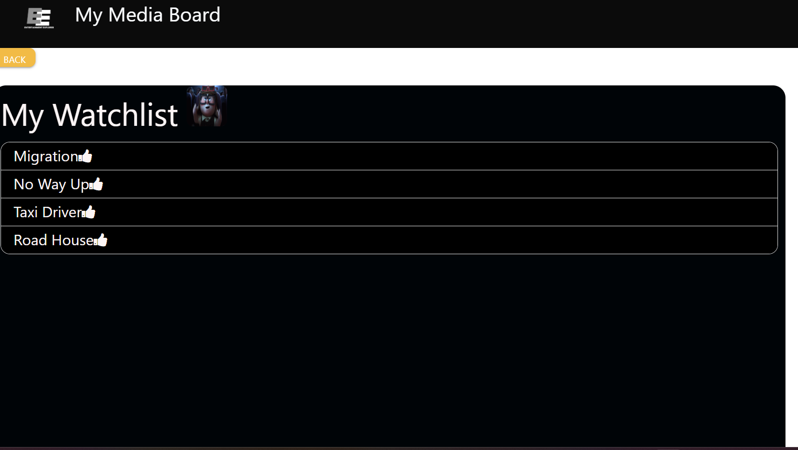

# Entertainment-Explorer-Group-Project-1-1

## Description
The 2 Server-sides apis used were TMDB for suggestions and OMDB for search.

## Usage
The user can search for movies and add them to a media board. When they enter a movie name and click on search, it will display a modal with the movie's name, plot, and poster. The user will also have the option to add the movie to a watchlist. If they need movie suggestions, they can click on genre suggestions, which will provide a random movie from that genre along with the option to add it to the watchlist. Inside the watchlist, users can keep their information saved on their local computer.

 

## Credits

-Xavier Andrés Mendoza

-Xander Trask

-Dalya Kablawi

-Jhonalyn Golo

-Kelvin Mgbatogu

-Jaqueline Farias de Souza Esteves

## Deployed:  

https://maixusbetter.github.io/Entertainment-Explorer-Group-Project-1-1/

## GitHub repo: 

https://github.com/MaixusBetter/Entertainment-Explorer-Group-Project-1-1
